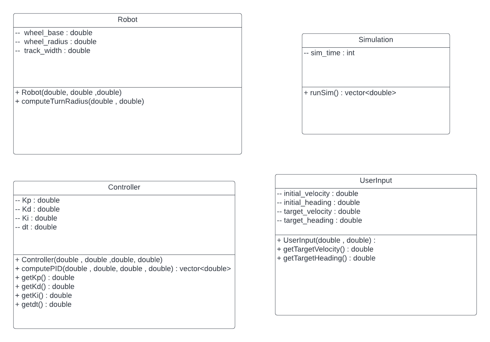

# C++ Boilerplate 
[](https://github.com/Irdab2000/ENPM808X-Midterm/.github/workflows/build_and_coveralls.yml)
[](https://coveralls.io/github//smitdumore/ENPM808X-Midterm/?branch=master

[](https://opensource.org/licenses/MIT)
---
## Author
- Driver for Phase 0 - Badrinaryanan Raghunathan Srikumar
- Navigator for Phase 0 - Smit Dumore

- Driver for Phase 1 - Smit Dumore
- Navigator for Phase 1 - Badrinaryanan Raghunathan Srikumar

## Overview

The objective of this project is to design and implement a controller for an Ackermann kinematic model for the Acme Robotics company. This controller can possibly be a component of a self driving car software stack. It can take inputs such as a goal location and goal heading from a path planning module and apply the appropriate control input to the motors of the vehicle. The input for our Ackermann controller is a target heading angle and velocity. The output will be the steering angles and angular velocities for each of the front wheel. We assume that the ideal steering angle for a given set of inputs is unique.

1. Ackermann steering geometry is a geometric arrangement of linkages in the steering of a car or other vehicle designed to solve the problem of wheel slippage while executing a turn. The model has independent steerable wheels, to execute a turn, the inner and outer wheels have to trace out concentric circles of different radii. This ensures that the wheels do not slip. 
2. The kinematic equations for this controller can be derived with basic trigonometry. These equations will be implemeted in C++ , because of its performance in real time systems. OOP practices will be used to make the code scalable.
3. The controller will use a PID control algorithm for calculating the ideal inputs to the system at every time step. The PID control has many advantages, the major advantage  being its simplicity. But, the biggest disadvantage of PID is that we cannot add any constraints to the output signals and sometimes it can reach very high values, which may not be possible to attain in physical systems. 
4. Here one of our constraints is that maximum steering angle constraint < 45 degrees. 

## AIP and Sprint planning

We followed Agile Iterative process throughout the develpment this project including pair programming , switching between Driver and Navigator roles in phase 0 and 1.
The Product Backlog, Iteration Backlog and Work Log and sprint planning sheets can be found below:

1. https://docs.google.com/spreadsheets/d/15MsHHnaPDYa6_ac9_E7A4tZtzg4NLevfynDoTfalXG4/edit#gid=0
2. https://docs.google.com/document/d/1Jcqsh3hmOmNMl5sPOOUJDDctLigFcafv_c4tUjaEYhQ/edit

## UML Diagram
<p align="center">

</p>

##Quad Chart
<p align="center">

</p>

## Presentation video link 

Phase 0 :
 -https://youtu.be/P2H2bpZX4jc

## Compiling and running via command-line
```
git clone --recursive https://github.com/smitdumore/ENPM808X-Midterm.git
cd <path to repository>
mkdir build
cd build
cmake ..
make
Run programme: ./app/shell-app
Enter target heading in degrees
Enter target speed in m/s

Run test: ./test/cpp-test
```

## Building for code coverage (for assignments beginning in Week 4)
```
sudo apt-get install lcov
cmake -D COVERAGE=ON -D CMAKE_BUILD_TYPE=Debug ../
make
make code_coverage
```
This generates a index.html page in the build/coverage sub-directory that can be viewed locally in a web browser.

## Working with Eclipse IDE ##

## Installation

In your Eclipse workspace directory (or create a new one), checkout the repo (and submodules)
```
mkdir -p ~/workspace
cd ~/workspace
git clone --recursive https://github.com/dpiet/cpp-boilerplate
```

In your work directory, use cmake to create an Eclipse project for an [out-of-source build] of cpp-boilerplate

```
cd ~/workspace
mkdir -p boilerplate-eclipse
cd boilerplate-eclipse
cmake -G "Eclipse CDT4 - Unix Makefiles" -D CMAKE_BUILD_TYPE=Debug -D CMAKE_ECLIPSE_VERSION=4.7.0 -D CMAKE_CXX_COMPILER_ARG1=-std=c++14 ../cpp-boilerplate/
```

## Import

Open Eclipse, go to File -> Import -> General -> Existing Projects into Workspace -> 
Select "boilerplate-eclipse" directory created previously as root directory -> Finish

# Edit

Source files may be edited under the "[Source Directory]" label in the Project Explorer.


## Build

To build the project, in Eclipse, unfold boilerplate-eclipse project in Project Explorer,
unfold Build Targets, double click on "all" to build all projects.

## Run

1. In Eclipse, right click on the boilerplate-eclipse in Project Explorer,
select Run As -> Local C/C++ Application

2. Choose the binaries to run (e.g. shell-app, cpp-test for unit testing)


## Debug


1. Set breakpoint in source file (i.e. double click in the left margin on the line you want 
the program to break).

2. In Eclipse, right click on the boilerplate-eclipse in Project Explorer, select Debug As -> 
Local C/C++ Application, choose the binaries to run (e.g. shell-app).

3. If prompt to "Confirm Perspective Switch", select yes.

4. Program will break at the breakpoint you set.

5. Press Step Into (F5), Step Over (F6), Step Return (F7) to step/debug your program.

6. Right click on the variable in editor to add watch expression to watch the variable in 
debugger window.

7. Press Terminate icon to terminate debugging and press C/C++ icon to switch back to C/C++ 
perspetive view (or Windows->Perspective->Open Perspective->C/C++).


## Plugins

- CppChEclipse

    To install and run cppcheck in Eclipse

    1. In Eclipse, go to Window -> Preferences -> C/C++ -> cppcheclipse.
    Set cppcheck binary path to "/usr/bin/cppcheck".

    2. To run CPPCheck on a project, right click on the project name in the Project Explorer 
    and choose cppcheck -> Run cppcheck.


- Google C++ Sytle

    To include and use Google C++ Style formatter in Eclipse

    1. In Eclipse, go to Window -> Preferences -> C/C++ -> Code Style -> Formatter. 
    Import [eclipse-cpp-google-style][reference-id-for-eclipse-cpp-google-style] and apply.

    2. To use Google C++ style formatter, right click on the source code or folder in 
    Project Explorer and choose Source -> Format

[reference-id-for-eclipse-cpp-google-style]: https://raw.githubusercontent.com/google/styleguide/gh-pages/eclipse-cpp-google-style.xml

- Git

    It is possible to manage version control through Eclipse and the git plugin, but it typically requires creating another project. If you're interested in this, try it out yourself and contact me on Canvas.
